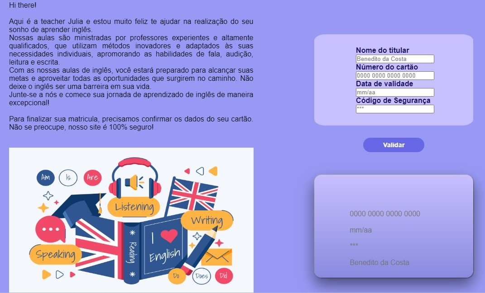

# Validação de Cartão de Crédito

Primeiro projeto do bootcamp junto com a Laboratória, tendo como objetivo de verificar cartão de crédito, simulando a comprar de aulas de inglês.

- jumvribeiro.github.io

## Índice
* [1. Introdução](#1-Introdução)
* [2. Produto](#2-Produto)
* [3. Interface](#3-interface)
* [4. Objetivos](#4-objetivos)
* [5. Ferramentas utilizadas](#5-ferramentas-utilizadas)

## Introdução

O produto é uma plataforma online que oferece aulas de inglês para diversos níveis de proficiência, com uma funcionalidade de validação de cartão para realizar o pagamento e garantir uma experiência segura aos usuários. A plataforma busca proporcionar uma experiência educacional interativa e eficiente para aqueles que desejam aprender ou aprimorar seus conhecimentos na língua inglesa.

Sendo assim, foi utilizado o algoritmo de Luhn, também chamado de módulo 10, é um método de soma de verificação, usado para validar números de identificação, como o IMEI de telefones celulares, cartões de crédito etc.

Esse algoritmo é simples. Obtemos o inverso do número a ser verificado (que contém apenas dígitos [0-9]); todos os números que ocupam uma posição par devem ser multiplicados por dois; se esse número for maior ou igual a 10, devemos adicionar os dígitos do resultado; o número a verificar será válido se a soma de seus dígitos finais for um múltiplo de 10.

## Produto

- Principais usuários do produto:

1. Alunos em busca de aprendizado: São os principais usuários da plataforma. Eles podem ser estudantes, profissionais ou qualquer pessoa interessada em aprender inglês. Os alunos têm diferentes níveis de proficiência e objetivos, desde iniciantes que desejam aprender o básico até estudantes avançados que buscam aperfeiçoar sua fluência.

2. Administradores e instrutores: São os responsáveis pela gestão e criação do conteúdo das aulas. Eles podem incluir professores de inglês, coordenadores de curso e outros membros da equipe pedagógica. Os administradores têm acesso a recursos e ferramentas para gerenciar as turmas, o conteúdo do curso e acompanhar o desempenho dos alunos.

- Objetivos dos usuários em relação ao produto:

1. Alunos em busca de aprendizado: Os alunos buscam uma plataforma de ensino de inglês que ofereça aulas de qualidade, materiais interativos, prática de conversação e flexibilidade de horários. Eles desejam aprender e aprimorar suas habilidades na língua inglesa de forma eficaz e agradável, com a possibilidade de escolher o nível de dificuldade adequado para suas necessidades.

2. Administradores e instrutores: Os administradores buscam uma plataforma que ofereça uma interface intuitiva para gerenciar turmas, criar e disponibilizar conteúdo de forma fácil e rápida, além de ferramentas para acompanhar o progresso dos alunos e avaliar o desempenho do curso.

- Resolução dos problemas pelos produtos:

1. Experiência do aluno: O produto busca resolver o problema de aprendizado de inglês ao oferecer aulas bem estruturadas, adaptadas a diferentes níveis de proficiência e estilos de aprendizado. Com recursos interativos, exercícios práticos, atividades de conversação e materiais complementares, os alunos têm a oportunidade de desenvolver suas habilidades de compreensão auditiva, leitura, escrita e fala de forma progressiva e eficiente.

2. Facilidade de pagamento e segurança: A funcionalidade de validação de cartão visa resolver o problema de processamento de pagamentos de forma segura e confiável. Isso dá tranquilidade aos alunos durante o processo de compra das aulas e evita possíveis problemas de fraude ou inconveniências relacionadas a transações financeiras.

## Interface

Processo para definir o produto em nível de experiência e interface:

1. Pesquisa de mercado: Realizamos pesquisas de mercado para entender as necessidades e expectativas dos potenciais usuários. Coletamos feedback de alunos, professores e profissionais da área de ensino de inglês para identificar os principais pontos de dor e desejos em relação ao aprendizado do idioma.

2. Definição de personas: Com base nas pesquisas, criamos personas representativas dos diferentes perfis de alunos e administradores. Isso nos ajudou a compreender melhor os objetivos, motivações e comportamentos dos usuários, permitindo-nos projetar uma experiência que atenda às suas necessidades específicas.

3. Iteração do design: Desenvolvemos protótipos e conduzimos testes de usabilidade com os usuários para obter feedback e insights valiosos. Com base nos resultados dos testes, refinamos a interface e a experiência do usuário para garantir que fosse intuitiva, fácil de usar e agradável.

4. Avaliação da segurança: Para a funcionalidade de validação de cartão, trabalhamos com especialistas em segurança para garantir que os dados dos usuários estejam protegidos e que o processo de pagamento seja seguro e confiável.

5. Feedback contínuo: Mantemos um canal aberto para receber feedback contínuo dos usuários, permitindo-nos realizar melhorias contínuas no produto com base nas necessidades e sugestões dos usuários.

Ao seguir esse processo, buscamos criar uma plataforma de ensino de inglês que ofereça uma experiência atraente e eficiente para os alunos, ao mesmo tempo em que atenda às necessidades dos administradores e instrutores responsáveis pelo conteúdo do curso. A validação de cartão assegura a segurança das transações e proporciona uma experiência tranquila para os usuários durante o processo de pagamento.

Com isso, foi pensado nas seguintes situações:

1. Usuário não digitar o numero do cartão;
  
  
2. Usuário não digitar todos os numeros do cartão;
   
   
3. Usuário não digitar corretamente o numero do cartão;
   
   
4. Cartão valido;
   
   
## Objetivo

1. Criação de uma interface onde o usuário é capaz de validar o número de um cartão de crédito.
2. Ocultar todos os dígitos de um cartão e ocultar o número até os 4 últimos dígitos.
3. Trabalhar e estudar as ferramentas de manutenção e melhoria no código, assim como linters e os testes unitários.
4. Adquirir conhecimento sobre o Git e Github.

## Ferramentas Utilizadas

- HTML
- JavaScript
- CSS
- GitHub
